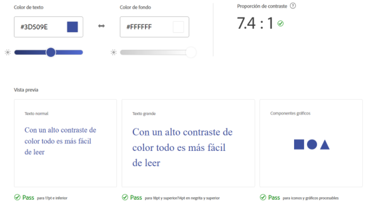
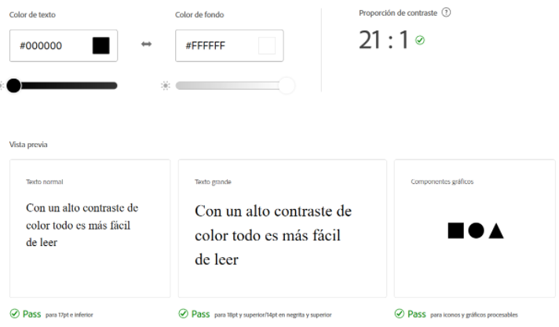
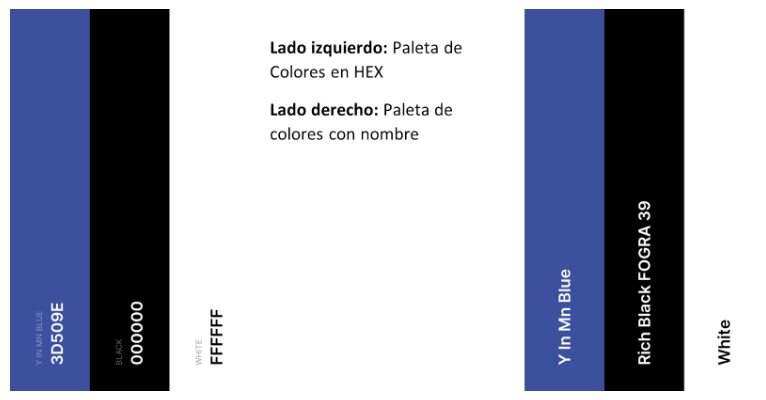
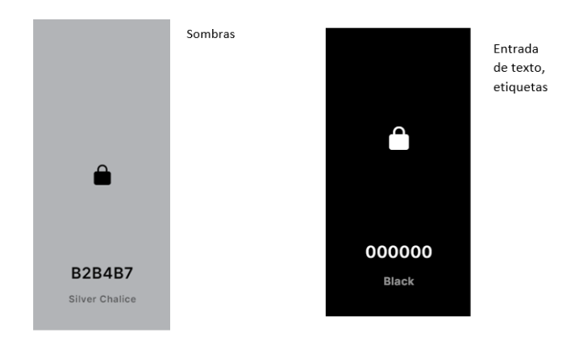
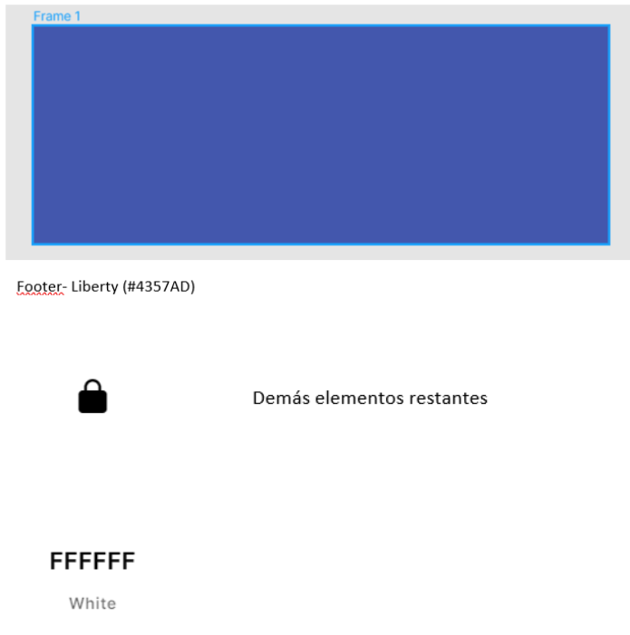
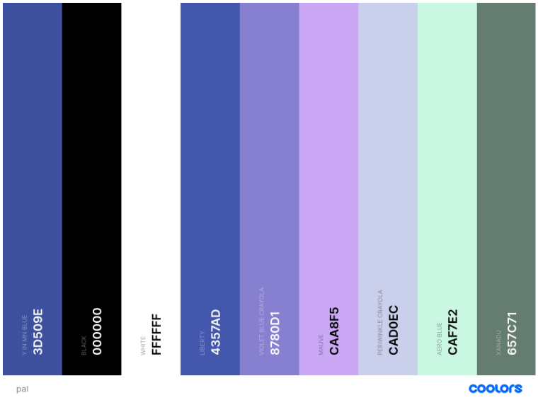

# **Guía de Estilos**

Esta guía de estilos contiene la definición de los elementos que serán utilizados en el aplicativo web Smart Money Project Online y que serán visibles en todas las interfaces de este servicio. En esta guía se especificarán los estilos, tanto de los colores como la tipografía, que serán utilizados durante el desarrollo de la aplicación.

## **Objetivos de la guía de estilos**

La guía de estilos nos ayudará a conseguir que la interfaz sea realizada de forma uniforme y que sea adecuada y atractiva para el público objetivo, por tal motivo esta guía cumple con los siguientes objetivos:

### **Coherencia visual**
Se deben definir los estilos de los elementos(paleta de colores, tipografía, tamaño, estilo, etc) de forma que estos sean fácilmente relacionados al producto que estamos realizando y se mantengan uniformes a lo largo del desarrollo.

### **Contexto**
Se presentan casos de uso de los elementos utilizados, de esta forma se podrá apreciar las características de estos elementos en el contexto en el cual serán aplicados y cómo serán apreciados por los usuarios.

### **Orientación**
La guía de estilos orienta a los encargados de desarrollar las interfaces para que puedan implementar el diseño de forma uniforme y coherente con lo deseado para la página web. Por ello en esta guía se definen los términos, características y formas de uso de los elementos.

### **Estandarización del código**
La guía permite a los desarrolladores mantener los estándares establecidos para la realización de las interfaces del proyecto, asimismo la estandarización ayuda a mejorar la accesibilidad de la página web.

### **Consolidación**
Esta guía permite que todo el equipo involucrado (diseñadores y desarrolladores) puedan acceder a una sola fuente en la cual estarán presentes las características de los elementos visuales del software a desarrollar, de esta forma todos estarán informados del estilo de diseño utilizado durante el desarrollo de Smart Money Project Online.

**Estilos**

- **Colores**

Para el proyecto SmartMoney se utilizará las variables propias del proyecto, como por ejemplo $smpo-text-color en lugar del código HEX #0000. Esto permitirá que se utilice la paleta de colores más reciente.

**Contraste de colores AAA (WCAG 2.0)**

Debes asegurarte de que el contraste entre un texto y el fondo cumpla con el nivel AAA de las.[Guías de accesibilidad web (WCAG 2.0)](https://www.w3.org/TR/WCAG20/).

**Usos y aplicaciones**

  - Texto

  - Enlaces

  - Bordes

  - Fondos

**Paleta de colores**

Los esquemas de color secundarios no tienen que ser coloridos. Solo necesitan contrastar con los elementos circundantes y usarse con moderación en toda la interfaz de usuario.

## **Tipografia**
Las tipografías que utilizamos para Smart Money Project son Gotham Rounded y Coco Gothic. Gotham Rounded se utilizó para títulos y subtítulos, mientras que Coco Gothic se utilizó para los cuerpos de texto. Ambas fuentes fueron extraídas de wfonts.	

### **Gotham Rounded**
Es la fuente que Smart Money Project usa para los títulos. Esta fuente se caracteriza por sus bordes redondeados y su diseño amigable.
Características

### **Caracteristicas**
#### **Clasificación**
Gotham Rounded es una fuente rounded, lo que significa que están diseñadas con cierres redondeados. Lo que permite dar una apariencia llamativa a los títulos.

 
#### **Weight**
Utilizamos solo un peso para mostrar los títulos de forma llamativa. La fuente en Bold es usada para destacar el texto en el título.

#### **Tamaños**
- Títulos en la landing page:

- Títulos en pantallas con funcionalidad:

### **Coco Gothic**
Es la fuente que Smart Money Project usa para los textos y subtítulos. Esta fuente también cuenta con bordes rectos y un contraste adecuado con Gotham Rounded.

### **Caracteristicas**
#### **Clasificación**
Coco Gothic es una fuente Sans serif, que significa que no tiene terminaciones o decoraciones en los extremos de las letras

#### **Weight**
Usamos dos pesos diferentes con esta fuente para jerarquizar el texto de manera ordenada. La fuente en regular es suave y fácil de leer. La fuente en Bold se distingue fácilmente del resto del texto y permite ser identificada rápidamente.

#### **Tamaños**
- Texto párrafos

- Texto en botones

